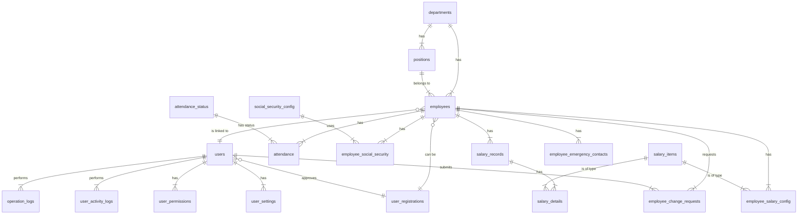

# 工资管理系统 - 后端架构设计文档

## 1. 概述

本文档旨在深入解析工资管理系统后端服务的架构设计与工作流程。后端服务基于 **FastAPI** 框架构建，采用分层架构，实现了业务逻辑、数据访问和API接口的清晰分离。

### 1.1. 技术栈

- **Web框架**: FastAPI
- **数据库 ORM**: SQLAlchemy
- **数据校验**: Pydantic
- **数据库**: MySQL (通过 `mysqlclient` 连接)
- **认证**: JWT (JSON Web Tokens)

### 1.2. 项目结构

后端应用遵循一种模块化的、按功能领域划分的结构，主要文件和目录位于 `backend/app/` 下：

```
backend/app/
|
├── api/              # API 接口层
│   └── api_v1/
│       ├── api.py    # API 路由聚合
│       └── endpoints/  # 各模块的 API 端点
│
├── core/             # 核心配置与安全
│   ├── config.py     # 全局配置
│   └── security.py   # 密码处理、JWT 令牌
│
├── crud/             # 数据访问层 (Create, Read, Update, Delete)
│   ├── base.py       # CRUD 基类
│   └── crud_*.py     # 各模型的 CRUD 实现
│
├── db/               # 数据库配置与会话管理
│   ├── base.py       # 数据库模型基类和引擎创建
│   └── session.py    # 数据库会话
│
├── models/           # SQLAlchemy 数据模型
│   └── *.py          # 各数据表的模型定义
│
├── schemas/          # Pydantic 数据模式 (用于 API 数据校验)
│   └── *.py          # 各 API 端点的数据输入输出模型
│
├── services/         # 业务逻辑层
│   └── *.py          # 封装复杂业务逻辑
│
└── utils/            # 工具函数
    ├── log.py        # 日志配置
    └── permissions.py # 权限依赖
```

## 2. 数据模型层 (Models)

数据模型层使用 SQLAlchemy ORM 定义，将 Python 类映射到数据库表。所有模型都继承自 `db.base_class.Base`。

### 2.1. 模型关系图 (ER Diagram)

下图展示了主要数据模型之间的关系：



### 2.2. 关键模型说明

- **`Employee`**: 核心模型，存储员工基本信息，并与其他模型（如 `Department`, `Position`, `User`, `SalaryRecord`）建立外键关联。
- **`User`**: 用户模型，负责系统认证。通过 `employee_id` 与 `Employee` 模型建立一对一关联。包含 `role` 字段用于权限控制。
- **`SalaryRecord` & `SalaryDetail`**: `SalaryRecord` 记录了员工某月的总体薪资情况，而 `SalaryDetail` 则将这笔薪资拆分为具体的项目（如基本工资、奖金、扣款），形成一对多关系。
- **`Attendance` & `AttendanceStatus`**: `Attendance` 记录员工每日考勤，其 `status_id` 指向 `AttendanceStatus` 表，用于表示"正常"、"迟到"等状态。

## 3. 数据校验层 (Schemas)

Schemas 层使用 Pydantic 模型，主要作用有三：
1.  **类型提示与校验**: 在 API 接收请求时，FastAPI 会使用 Pydantic 模型对请求体（Body）进行校验。如果数据格式或类型不匹配，会自动返回 422 错误。
2.  **数据过滤与塑形**: 定义 API 的响应模型 (`response_model`)，可以精确控制返回给客户端的字段，避免敏感数据（如密码哈希）泄露。
3.  **代码提示与文档生成**: Pydantic 模型为编辑器提供了良好的类型提示，并且 FastAPI 会基于这些模型自动生成交互式 API 文档（Swagger UI / ReDoc）。

每个模型通常会对应多个 Pydantic Schema：
- **`...Base`**: 包含创建和更新时共享的字段。
- **`...Create`**: 继承自 `Base`，用于创建新记录时的数据校验。
- **`...Update`**: 继承自 `Base`，用于更新记录，所有字段通常是可选的。
- **`...InDB`**: 继承自 `Base`，包含存储在数据库中的所有字段（包括 ID、时间戳等）。
- **`...` (主模型)**: 用于 API 响应，决定哪些字段会返回给前端。

## 4. 数据访问层 (CRUD)

CRUD (Create, Read, Update, Delete) 层将数据库操作逻辑封装起来，为上层（API层）提供简洁、可重用的接口。

- **`crud.base.CRUDBase`**: 定义了通用的 CRUD 方法，如 `get`, `get_multi`, `create`, `update`, `remove`。
- **`crud.crud_*.py`**: 每个主要的 SQLAlchemy 模型都有一个对应的 CRUD 文件，它继承自 `CRUDBase` 并可能实现一些该模型特有的查询方法。例如，`crud.crud_user.get_by_username()`。

这种分层使得 API 层的代码更专注于处理 HTTP 请求和业务逻辑，而无需关心底层的 SQLAlchemy 查询语法。

## 5. API 接口层 (API)

API 层是整个后端服务的入口，使用 FastAPI 构建。

- **`api.api_v1.api.py`**: 这是 API v1 版本的路由聚合文件。它使用 `APIRouter` 将不同模块的路由组织在一起，便于管理和版本控制。
- **`api.api_v1.endpoints/`**: 该目录下存放着按功能划分的路由模块。每个文件（如 `users.py`, `employees.py`）都定义了一个 `APIRouter`，包含了与该功能相关的所有端点。

### 5.1. 依赖注入 (Dependency Injection)

FastAPI 的依赖注入系统是框架的核心特性之一，在本项目中主要用于：
- **数据库会话管理 (`api.deps.get_db`)**: 这是一个依赖项，它为每个请求创建一个新的数据库会话 (`Session`)，在请求处理完成后关闭它。这确保了数据库连接的正确管理。
- **用户认证与授权 (`api.deps.get_current_active_user`, `utils.permissions.*`)**:
    - `get_current_active_user`: 从请求头中解析 JWT 令牌，验证其有效性，并从数据库中获取当前用户信息。
    - `PermissionChecker` (`utils.permissions.py`): 一个更高级的依赖，可以根据用户角色进行权限检查，如果用户不具备所需权限，则直接中断请求并返回 403 错误。

## 6. 核心服务 (Core)

`core` 目录存放着应用的全局配置和核心功能。
- **`core.config.settings`**: 使用 Pydantic 的 `BaseSettings`，可以从环境变量或 `.env` 文件中加载配置，如数据库 URL、JWT 密钥等。
- **`core.security`**: 提供了密码哈希（使用 `bcrypt`）、密码验证和 JWT 令牌创建与解码的功能。

## 7. 后端服务工作流程（示例：用户登录）

以下是用户登录场景下的后端工作流程：

1.  **接收请求**: 前端向 `/api/v1/login/access-token` 发送一个 POST 请求，请求体中包含用户名和密码。
2.  **路由匹配**: FastAPI 找到 `endpoints.auth.py` 中处理此路径的 `login_access_token` 函数。
3.  **数据校验**: 请求体的数据被自动解析和校验，因为函数参数被注解为 `data: OAuth2PasswordRequestForm = Depends()`。
4.  **数据库会话**: `get_db` 依赖被调用，创建一个数据库会话 `db` 并传递给 `login_access_token` 函数。
5.  **用户认证**:
    - 函数调用 `crud.user.authenticate` 方法。
    - 该方法首先调用 `crud.user.get_by_username` 从数据库中查找用户。
    - 如果用户存在，则调用 `security.verify_password` 验证请求中提供的密码与数据库中存储的哈希是否匹配。
6.  **令牌生成**:
    - 如果认证成功，`login_access_token` 函数调用 `security.create_access_token`，将用户的 `id` (作为 `sub`) 编码到一个新的 JWT 令牌中。
7.  **返回响应**: 函数将生成的 `access_token` 和 `token_type` 包装在一个 JSON 对象中，返回给前端。
8.  **请求结束**: FastAPI 负责关闭由 `get_db` 创建的数据库会话。

此流程清晰地展示了各层如何协同工作：API 层处理 HTTP 协议，CRUD 层处理数据库交互，Security 模块处理认证逻辑，而这一切都由 FastAPI 的依赖注入系统优雅地串联起来。 