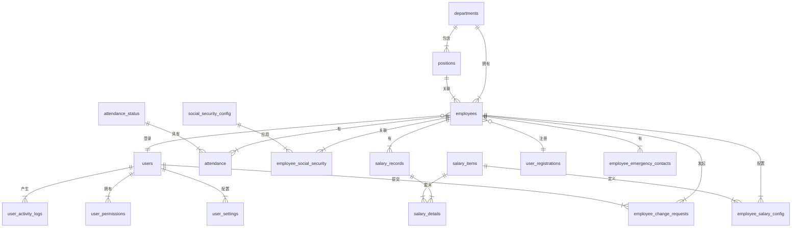

# 工资管理系统 - 数据库设计文档

## 1. 概述

本文档详细描述了工资管理系统的数据库结构设计，该设计基于 `consolidated_database_schema.sql` 脚本。文档内容涵盖了所有数据表、字段、关系、视图和触发器，旨在为开发和维护工作提供清晰、全面的数据层参考。

## 2. 实体关系图 (ER Diagram)

## 3. 数据表设计

### 3.1. 核心模块 (组织与员工)

#### 3.1.1. `departments` - 部门信息表
存储公司所有部门的基本信息。

| 字段名      | 数据类型      | 约束                                      | 描述            |
|-------------|---------------|-------------------------------------------|-----------------|
| `id`        | `INT`         | PK, AI                                    | 部门唯一标识    |
| `name`      | `VARCHAR(50)` | NOT NULL                                  | 部门名称        |
| `description` | `VARCHAR(255)`| NULL                                      | 部门描述        |
| `created_at`  | `TIMESTAMP`   | DEFAULT `CURRENT_TIMESTAMP`               | 创建时间        |
| `updated_at`  | `TIMESTAMP`   | DEFAULT `CURRENT_TIMESTAMP` ON UPDATE `CURRENT_TIMESTAMP` | 更新时间        |

#### 3.1.2. `positions` - 职位信息表
存储公司所有职位的信息，并关联到部门。

| 字段名        | 数据类型       | 约束                                      | 描述             |
|---------------|----------------|-------------------------------------------|------------------|
| `id`          | `INT`          | PK, AI                                    | 职位唯一标识     |
| `name`        | `VARCHAR(50)`  | NOT NULL                                  | 职位名称         |
| `department_id` | `INT`          | NOT NULL, FK -> `departments(id)`         | 所属部门ID       |
| `description`   | `VARCHAR(255)` | NULL                                      | 职位描述         |
| `created_at`    | `TIMESTAMP`    | DEFAULT `CURRENT_TIMESTAMP`               | 创建时间         |
| `updated_at`    | `TIMESTAMP`    | DEFAULT `CURRENT_TIMESTAMP` ON UPDATE `CURRENT_TIMESTAMP` | 更新时间         |

#### 3.1.3. `employees` - 员工信息表
核心表之一，存储员工的详细个人和职位信息。

| 字段名                   | 数据类型        | 约束                                      | 描述                     |
|----------------------------|-----------------|-------------------------------------------|--------------------------|
| `id`                       | `INT`           | PK, AI                                    | 员工唯一标识             |
| `name`                     | `VARCHAR(50)`   | NOT NULL                                  | 姓名                     |
| `department_id`            | `INT`           | NOT NULL, FK -> `departments(id)`         | 部门ID                   |
| `position_id`              | `INT`           | NOT NULL, FK -> `positions(id)`           | 职位ID                   |
| `base_salary`              | `DECIMAL(10,2)` | NOT NULL                                  | 基本工资                 |
| `hire_date`                | `DATE`          | NOT NULL                                  | 入职日期                 |
| `phone`                    | `VARCHAR(20)`   | NULL                                      | 联系电话                 |
| `email`                    | `VARCHAR(100)`  | NULL                                      | 电子邮箱                 |
| `address`                  | `VARCHAR(255)`  | NULL                                      | 地址                     |
| `id_card`                  | `VARCHAR(18)`   | NULL                                      | 身份证号                 |
| `bank_name`                | `VARCHAR(100)`  | NULL                                      | 开户行                   |
| `bank_account`             | `VARCHAR(100)`  | NULL                                      | 银行账号                 |
| `bank_account_encrypted`   | `VARBINARY(255)`| NULL                                      | 加密后的银行账号         |
| `emergency_contact_name`   | `VARCHAR(50)`   | NULL                                      | 紧急联系人姓名           |
| `emergency_contact_phone`  | `VARCHAR(20)`   | NULL                                      | 紧急联系人电话           |
| `emergency_contact_relationship` | `VARCHAR(20)` | NULL                                  | 紧急联系人关系           |
| `status`                   | `TINYINT`       | DEFAULT 1                                 | 状态(1:在职, 0:离职)     |

### 3.2. 考勤模块

#### 3.2.1. `attendance_status` - 考勤状态表
定义了所有可能的考勤状态，如正常、迟到、缺勤等。

| 字段名          | 数据类型        | 约束      | 描述                 |
|-----------------|-----------------|-----------|----------------------|
| `id`            | `INT`           | PK, AI    | 状态唯一标识         |
| `name`          | `VARCHAR(20)`   | NOT NULL  | 状态名称             |
| `description`   | `VARCHAR(100)`  | NULL      | 状态描述             |
| `is_deduction`  | `TINYINT`       | DEFAULT 0 | 是否扣款(1:是, 0:否) |
| `deduction_value` | `DECIMAL(10,2)` | DEFAULT 0 | 扣款金额或比例       |

#### 3.2.2. `attendance` - 考勤记录表
记录每个员工每天的考勤情况。

| 字段名           | 数据类型        | 约束                                           | 描述               |
|------------------|-----------------|------------------------------------------------|--------------------|
| `id`             | `INT`           | PK, AI                                         | 记录唯一标识       |
| `employee_id`    | `INT`           | NOT NULL, FK -> `employees(id)`                | 员工ID             |
| `date`           | `DATE`          | NOT NULL                                       | 日期               |
| `status_id`      | `INT`           | NOT NULL, FK -> `attendance_status(id)`        | 出勤状态ID         |
| `overtime_hours` | `DECIMAL(5,2)`  | DEFAULT 0                                      | 加班时长(小时)     |
| `remarks`        | `VARCHAR(255)`  | NULL                                           | 备注               |
- **唯一约束:** `uk_employee_date` (`employee_id`, `date`) 确保每个员工每天只有一条考勤记录。

### 3.3. 薪资模块

#### 3.3.1. `salary_items` - 工资组成项目表
定义了所有可能的薪资项目，如基本工资、奖金、补贴、扣款等。

| 字段名        | 数据类型                         | 约束      | 描述                          |
|---------------|----------------------------------|-----------|-------------------------------|
| `id`          | `INT`                            | PK, AI    | 项目唯一标识                  |
| `name`        | `VARCHAR(50)`                    | NOT NULL  | 项目名称                      |
| `type`        | `ENUM('addition', 'deduction')`  | NOT NULL  | 类型(加项/减项)               |
| `is_percentage` | `TINYINT`                        | DEFAULT 0 | 是否百分比(1:是, 0:否)        |
| `is_system`   | `TINYINT`                        | DEFAULT 0 | 是否系统项(1:是, 0:否)        |

#### 3.3.2. `salary_records` - 工资记录表
存储每个员工每月的工资发放总记录。

| 字段名                   | 数据类型                 | 约束                               | 描述                     |
|----------------------------|--------------------------|------------------------------------|--------------------------|
| `id`                       | `INT`                    | PK, AI                             | 工资记录唯一标识         |
| `employee_id`              | `INT`                    | NOT NULL, FK -> `employees(id)`    | 员工ID                   |
| `year`                     | `INT`                    | NOT NULL                           | 年份                     |
| `month`                    | `INT`                    | NOT NULL                           | 月份                     |
| `base_salary`              | `DECIMAL(10,2)`          | NOT NULL                           | 基本工资                 |
| `overtime_pay`             | `DECIMAL(10,2)`          | DEFAULT 0                          | 加班费                   |
| `bonus`                    | `DECIMAL(10,2)`          | DEFAULT 0                          | 奖金                     |
| `performance_bonus`        | `DECIMAL(10,2)`          | DEFAULT 0                          | 绩效奖金                 |
| `attendance_bonus`         | `DECIMAL(10,2)`          | DEFAULT 0                          | 全勤奖                   |
| `transportation_allowance` | `DECIMAL(10,2)`          | DEFAULT 0                          | 交通补贴                 |
| `meal_allowance`           | `DECIMAL(10,2)`          | DEFAULT 0                          | 餐补                     |
| `deduction`                | `DECIMAL(10,2)`          | DEFAULT 0                          | 扣款(通用)               |
| `social_security`          | `DECIMAL(10,2)`          | DEFAULT 0                          | 社保公积金               |
| `late_deduction`           | `DECIMAL(10,2)`          | DEFAULT 0                          | 迟到扣款                 |
| `absence_deduction`        | `DECIMAL(10,2)`          | DEFAULT 0                          | 缺勤扣款                 |
| `personal_tax`             | `DECIMAL(10,2)`          | DEFAULT 0                          | 个人所得税               |
| `net_salary`               | `DECIMAL(10,2)`          | NOT NULL                           | 实发工资                 |
| `status`                   | `ENUM('pending', 'paid')`| DEFAULT 'pending'                  | 发放状态                 |
| `payment_date`             | `DATETIME`               | NULL                               | 发放日期                 |
| `remark`                   | `VARCHAR(255)`           | NULL                               | 备注                     |
- **唯一约束:** `uk_employee_year_month` (`employee_id`, `year`, `month`) 确保每个员工每月只有一条工资记录。

#### 3.3.3. `salary_details` - 工资明细表
存储每条工资记录的具体构成明细。

| 字段名      | 数据类型        | 约束                                       | 描述             |
|-------------|-----------------|--------------------------------------------|------------------|
| `id`        | `INT`           | PK, AI                                     | 明细唯一标识     |
| `salary_id` | `INT`           | NOT NULL, FK -> `salary_records(id)`       | 工资记录ID       |
| `item_id`   | `INT`           | NOT NULL, FK -> `salary_items(id)`         | 工资项目ID       |
| `amount`    | `DECIMAL(10,2)` | NOT NULL                                   | 金额             |

#### 3.3.4. `employee_salary_config` - 员工薪资配置表
为特定员工配置非通用的薪资项目，如特定的补贴或扣款。

| 字段名           | 数据类型        | 约束                               | 描述                         |
|------------------|-----------------|------------------------------------|------------------------------|
| `id`             | `INT`           | PK, AI                             | 配置唯一标识                 |
| `employee_id`    | `INT`           | NOT NULL, FK -> `employees(id)`    | 员工ID                       |
| `item_id`        | `INT`           | NOT NULL, FK -> `salary_items(id)` | 薪资项目ID                   |
| `value`          | `DECIMAL(10,2)` | NOT NULL                           | 金额或百分比值               |
| `base_item`      | `VARCHAR(50)`   | NULL                               | 基准项目(用于百分比计算)     |
| `is_active`      | `TINYINT`       | DEFAULT 1                          | 是否启用(1:是, 0:否)         |
| `effective_date` | `DATE`          | NOT NULL                           | 生效日期                     |
| `expiry_date`    | `DATE`          | NULL                               | 失效日期                     |
- **唯一约束:** `uk_employee_item_date` (`employee_id`, `item_id`, `effective_date`) 确保同一员工同一项目在同一时间只有一个有效配置。

### 3.4. 社保模块

#### 3.4.1. `social_security_config` - 社保公积金配置表
存储不同地区的社保和公积金缴费比例方案。

| 字段名            | 数据类型        | 约束      | 描述               |
|-------------------|-----------------|-----------|--------------------|
| `id`              | `INT`           | PK, AI    | 配置唯一标识       |
| `name`            | `VARCHAR(50)`   | NOT NULL  | 配置名称           |
| `pension_rate`    | `DECIMAL(5,2)`  | NOT NULL  | 养老保险比例       |
| `medical_rate`    | `DECIMAL(5,2)`  | NOT NULL  | 医疗保险比例       |
| `unemployment_rate`| `DECIMAL(5,2)`  | NOT NULL  | 失业保险比例       |
| `injury_rate`     | `DECIMAL(5,2)`  | NOT NULL  | 工伤保险比例       |
| `maternity_rate`  | `DECIMAL(5,2)`  | NOT NULL  | 生育保险比例       |
| `housing_fund_rate`| `DECIMAL(5,2)`  | NOT NULL  | 住房公积金比例     |
| `is_default`      | `TINYINT`       | DEFAULT 0 | 是否默认(1:是, 0:否) |

#### 3.4.2. `employee_social_security` - 员工社保公积金配置表
关联员工和社保方案，并记录其缴费基数。

| 字段名              | 数据类型        | 约束                                            | 描述             |
|---------------------|-----------------|-------------------------------------------------|------------------|
| `id`                | `INT`           | PK, AI                                          | 唯一标识         |
| `employee_id`       | `INT`           | NOT NULL, FK -> `employees(id)`                 | 员工ID           |
| `config_id`         | `INT`           | NOT NULL, FK -> `social_security_config(id)`    | 社保配置ID       |
| `base_number`       | `DECIMAL(10,2)` | NOT NULL                                        | 社保基数         |
| `housing_fund_base` | `DECIMAL(10,2)` | NOT NULL                                        | 公积金基数       |
| `effective_date`    | `DATE`          | NOT NULL                                        | 生效日期         |

### 3.5. 用户与权限模块

#### 3.5.1. `users` - 用户表
存储可以登录系统的用户信息，与员工信息关联。

| 字段名        | 数据类型                               | 约束                              | 描述                     |
|---------------|------------------------------------------|-----------------------------------|--------------------------|
| `id`          | `INT`                                    | PK, AI                            | 用户唯一标识             |
| `username`    | `VARCHAR(50)`                            | NOT NULL, UNIQUE                  | 用户名                   |
| `password`    | `VARCHAR(255)`                           | NOT NULL                          | 密码(加密存储)           |
| `employee_id` | `INT`                                    | NULL, FK -> `employees(id)`       | 关联员工ID               |
| `role`        | `ENUM('admin', 'hr', 'manager', 'employee')` | NOT NULL                        | 角色                     |
| `is_active`   | `TINYINT`                                | DEFAULT 1                         | 是否激活(1:是, 0:否)     |
| `last_login`  | `DATETIME`                               | NULL                              | 上次登录时间             |

#### 3.5.2. `user_registrations` - 用户注册申请表
用于支持用户自助注册功能，记录待审核的注册申请。

| 字段名               | 数据类型                           | 约束                            | 描述                     |
|----------------------|------------------------------------|---------------------------------|--------------------------|
| `id`                 | `INT`                              | PK, AI                          | 申请唯一标识             |
| `username`           | `VARCHAR(50)`                      | NOT NULL                        | 用户名                   |
| `password`           | `VARCHAR(255)`                     | NOT NULL                        | 密码(加密存储)           |
| `real_name`          | `VARCHAR(50)`                      | NOT NULL                        | 真实姓名                 |
| `id_card`            | `VARCHAR(18)`                      | NOT NULL                        | 身份证号                 |
| `phone`              | `VARCHAR(20)`                      | NOT NULL                        | 手机号                   |
| `email`              | `VARCHAR(100)`                     | NULL                            | 邮箱                     |
| `employee_id`        | `INT`                              | NULL, FK -> `employees(id)`     | 申请绑定的员工ID         |
| `verification_code`  | `VARCHAR(10)`                      | NULL                            | 验证码                   |
| `verification_expires`| `DATETIME`                         | NULL                            | 验证码过期时间           |
| `status`             | `ENUM('pending', 'approved', 'rejected')`| DEFAULT 'pending'               | 审核状态                 |
| `admin_id`           | `INT`                              | NULL, FK -> `users(id)`         | 审核管理员ID             |
| `admin_remarks`      | `VARCHAR(255)`                     | NULL                            | 管理员审核备注           |

#### 3.5.3. `user_permissions` - 用户权限配置表
细粒度控制用户特定权限，如查看薪资、考勤等。

| 字段名          | 数据类型                                                           | 约束                            | 描述               |
|-----------------|--------------------------------------------------------------------|---------------------------------|--------------------|
| `id`            | `INT`                                                              | PK, AI                          | 权限唯一标识       |
| `user_id`       | `INT`                                                              | NOT NULL, FK -> `users(id)`     | 用户ID             |
| `permission_type`| `ENUM('view_salary', 'view_attendance', 'edit_profile', 'view_payslip')` | NOT NULL                        | 权限类型           |
| `is_granted`    | `TINYINT`                                                          | DEFAULT 1                       | 是否授权(1:是, 0:否) |
| `granted_by`    | `INT`                                                              | NULL, FK -> `users(id)`         | 授权人ID           |
- **唯一约束:** `uk_user_permission` (`user_id`, `permission_type`) 确保用户同种权限只有一条记录。

#### 3.5.4. `employee_change_requests` - 员工信息变更申请表
记录员工通过自助服务提交的个人信息变更请求。

| 字段名        | 数据类型                                                    | 约束                            | 描述             |
|---------------|-------------------------------------------------------------|---------------------------------|------------------|
| `id`          | `INT`                                                       | PK, AI                          | 申请唯一标识     |
| `employee_id` | `INT`                                                       | NOT NULL, FK -> `employees(id)` | 员工ID           |
| `user_id`     | `INT`                                                       | NOT NULL, FK -> `users(id)`     | 申请用户ID       |
| `change_type` | `ENUM('phone', 'email', 'address', 'bank_info', 'emergency_contact')` | NOT NULL                    | 变更类型         |
| `field_name`  | `VARCHAR(50)`                                               | NOT NULL                        | 字段名称         |
| `old_value`   | `TEXT`                                                      | NULL                            | 原值             |
| `new_value`   | `TEXT`                                                      | NOT NULL                        | 新值             |
| `status`      | `ENUM('pending', 'approved', 'rejected')`                   | DEFAULT 'pending'               | 审核状态         |
| `admin_id`    | `INT`                                                       | NULL, FK -> `users(id)`         | 审核管理员ID     |

#### 3.5.5. `employee_emergency_contacts` - 员工紧急联系人表
存储员工的紧急联系人信息。

| 字段名         | 数据类型       | 约束                            | 描述               |
|----------------|----------------|---------------------------------|--------------------|
| `id`           | `INT`          | PK, AI                          | 唯一标识           |
| `employee_id`  | `INT`          | NOT NULL, FK -> `employees(id)` | 员工ID             |
| `contact_name` | `VARCHAR(50)`  | NOT NULL                        | 联系人姓名         |
| `relationship` | `VARCHAR(20)`  | NOT NULL                        | 关系               |
| `phone`        | `VARCHAR(20)`  | NOT NULL                        | 联系电话           |
| `is_primary`   | `TINYINT`      | DEFAULT 0                       | 是否主要联系人     |

### 3.6. 系统与日志模块

#### 3.6.1. `system_parameters` - 系统参数表
存储系统级别的配置参数。

| 字段名        | 数据类型       | 约束           | 描述       |
|---------------|----------------|----------------|------------|
| `id`          | `INT`          | PK, AI         | 唯一标识   |
| `param_key`   | `VARCHAR(50)`  | NOT NULL, UNIQUE | 参数键     |
| `param_value` | `VARCHAR(255)` | NOT NULL       | 参数值     |
| `description` | `VARCHAR(255)` | NULL           | 参数描述   |

#### 3.6.2. `operation_logs` (已废弃，由 `user_activity_logs` 替代)
旧版操作日志表。

#### 3.6.3. `user_activity_logs` - 用户活动日志表
新版日志表，用于记录用户的关键操作，以便审计和问题排查。

| 字段名          | 数据类型       | 约束                        | 描述       |
|-----------------|----------------|-----------------------------|------------|
| `id`            | `INT`          | PK, AI                      | 唯一标识   |
| `user_id`       | `INT`          | NOT NULL, FK -> `users(id)` | 用户ID     |
| `action_type`   | `VARCHAR(50)`  | NOT NULL                    | 操作类型   |
| `resource_type` | `VARCHAR(50)`  | NULL                        | 资源类型   |
| `resource_id`   | `INT`          | NULL                        | 资源ID     |
| `description`   | `TEXT`         | NULL                        | 操作描述   |
| `ip_address`    | `VARCHAR(50)`  | NULL                        | IP地址     |

#### 3.6.4. `user_settings` - 用户个人设置表
存储用户的个性化设置。

| 字段名          | 数据类型       | 约束                        | 描述       |
|-----------------|----------------|-----------------------------|------------|
| `id`            | `INT`          | PK, AI                      | 唯一标识   |
| `user_id`       | `INT`          | NOT NULL, FK -> `users(id)` | 用户ID     |
| `setting_key`   | `VARCHAR(50)`  | NOT NULL                    | 设置键     |
| `setting_value` | `VARCHAR(255)` | NOT NULL                    | 设置值     |
- **唯一约束:** `uk_user_setting` (`user_id`, `setting_key`)

## 4. 视图 (Views)

#### 4.1. `user_salary_view`
- **目的**: 为普通用户提供一个安全、整合的薪资记录查询视图。
- **内容**: 关联 `salary_records`, `employees`, `departments`, `positions` 表，展示员工个人的完整薪资信息，包括员工姓名、部门、职位等。
- **安全性**: 视图自带 `WHERE e.status = 1` 条件，默认只显示在职员工的记录。

#### 4.2. `user_attendance_view`
- **目的**: 为普通用户提供一个安全、整合的考勤记录查询视图。
- **内容**: 关联 `attendance`, `attendance_status`, `employees`, `departments`, `positions` 表，展示员工个人的考勤记录，并包含状态名称、员工姓名、部门等信息。
- **安全性**: 视图自带 `WHERE e.status = 1` 条件，默认只显示在职员工的记录。

## 5. 触发器 (Triggers)

#### 5.1. `calculate_net_salary_before_insert`
- **目标表**: `salary_records`
- **触发时机**: `BEFORE INSERT` (在插入新记录之前)
- **功能**: 根据各项津贴、奖金和扣款自动计算 `net_salary` (实发工资) 字段的值，确保数据一致性。

#### 5.2. `calculate_net_salary_before_update`
- **目标表**: `salary_records`
- **触发时机**: `BEFORE UPDATE` (在更新记录之前)
- **功能**: 当薪资记录的任何组成部分发生变化时，重新计算 `net_salary` 的值。

#### 5.3. `assign_default_permissions_after_user_creation`
- **目标表**: `users`
- **触发时机**: `AFTER INSERT` (在创建新用户之后)
- **功能**: 当一个角色为 `employee` 的新用户被创建时，自动在 `user_permissions` 表中为其插入默认的自助服务权限（如查看薪资、考勤等）。 