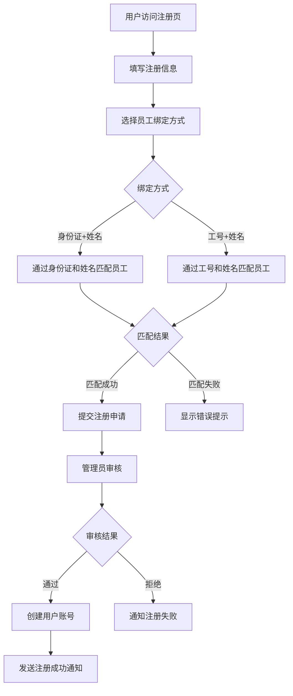
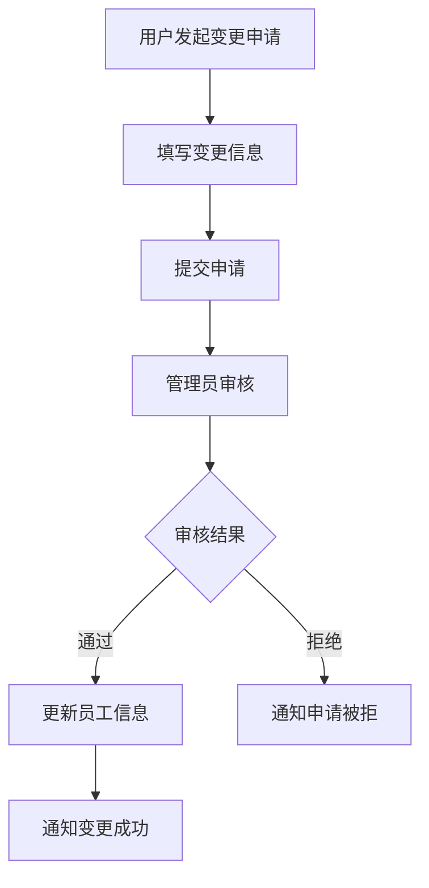

# 普通用户功能设计方案

## 1. 功能概述

### 1.1 设计目标
- 允许员工自助注册账号并绑定员工信息
- 提供个人薪资、考勤、个人信息的查看功能
- 支持部分个人信息的申请修改功能
- 实现权限控制和安全保护

### 1.2 核心功能模块
1. **用户注册与员工绑定**
2. **个人信息管理**
3. **薪资查询**
4. **考勤查询**
5. **信息变更申请**
6. **个人设置**

## 2. 详细功能设计

### 2.1 用户注册与员工绑定

#### 2.1.1 注册流程设计


#### 2.1.2 注册页面设计
- **基本信息**：用户名、密码、确认密码、真实姓名、手机号、邮箱
- **员工绑定**：身份证号、工号（二选一）、姓名验证
- **验证机制**：手机验证码、邮箱验证（可选）

#### 2.1.3 员工绑定逻辑
```sql
-- 身份证+姓名匹配
SELECT id FROM employees 
WHERE id_card = ? AND name = ? AND status = 1;

-- 工号+姓名匹配  
SELECT id FROM employees 
WHERE id = ? AND name = ? AND status = 1;
```

### 2.2 个人信息管理

#### 2.2.1 可查看信息
- **基本信息**：姓名、工号、部门、职位、入职日期、状态
- **联系信息**：手机、邮箱、地址
- **薪资信息**：基本工资（脱敏显示）
- **银行信息**：开户行、账号（脱敏显示）
- **紧急联系人**：姓名、关系、电话

#### 2.2.2 可申请修改信息
- **联系信息**：手机号、邮箱、联系地址
- **银行信息**：开户行、银行账号
- **紧急联系人**：联系人信息

#### 2.2.3 不可修改信息
- **基本信息**：姓名、身份证、工号、部门、职位
- **薪资信息**：基本工资、薪资配置

### 2.3 薪资查询功能

#### 2.3.1 薪资列表
- **查询条件**：年份、月份范围
- **显示字段**：年月、基本工资、加班费、奖金、扣款、社保、个税、实发工资、发放状态
- **操作功能**：查看详情、下载工资条

#### 2.3.2 薪资详情
- **收入明细**：基本工资、加班费、各类奖金、补贴
- **扣除明细**：社保个人部分、公积金、个税、各类扣款
- **统计信息**：应发总额、扣除总额、实发金额

#### 2.3.3 工资条生成
- **格式**：PDF格式工资条
- **内容**：完整薪资明细、计算公式、发放时间
- **安全**：添加水印、限制下载次数

### 2.4 考勤查询功能

#### 2.4.1 考勤列表
- **查询条件**：日期范围、考勤状态
- **显示字段**：日期、考勤状态、加班时长、备注
- **统计信息**：出勤天数、缺勤天数、加班总时长

#### 2.4.2 考勤统计
- **月度统计**：各状态考勤天数、加班统计
- **年度统计**：出勤率、年假使用情况
- **图表展示**：考勤趋势图、状态分布图

### 2.5 信息变更申请

#### 2.5.1 申请流程


#### 2.5.2 申请类型
- **联系信息变更**：手机、邮箱、地址
- **银行信息变更**：开户行、账号
- **紧急联系人变更**：联系人信息

#### 2.5.3 审核机制
- **申请记录**：记录变更前后值、申请原因
- **审核流程**：HR或管理员审核
- **通知机制**：审核结果通知

## 3. 前端页面设计

### 3.1 页面结构
```
普通用户端
├── 登录注册
│   ├── 登录页面
│   ├── 注册页面
│   └── 忘记密码页面
├── 个人中心
│   ├── 个人信息
│   ├── 修改密码
│   └── 个人设置
├── 薪资管理
│   ├── 薪资列表
│   ├── 薪资详情
│   └── 工资条下载
├── 考勤管理
│   ├── 考勤记录
│   └── 考勤统计
└── 申请管理
    ├── 信息变更申请
    ├── 申请记录
    └── 申请状态查询
```

### 3.2 导航菜单设计
```typescript
const userMenus = [
  {
    title: '个人中心',
    icon: 'User',
    children: [
      { title: '个人信息', path: '/user/profile' },
      { title: '修改密码', path: '/user/password' },
      { title: '个人设置', path: '/user/settings' }
    ]
  },
  {
    title: '薪资查询',
    icon: 'Money',
    children: [
      { title: '薪资列表', path: '/salary/list' },
      { title: '薪资统计', path: '/salary/statistics' }
    ]
  },
  {
    title: '考勤查询',
    icon: 'Calendar',
    children: [
      { title: '考勤记录', path: '/attendance/records' },
      { title: '考勤统计', path: '/attendance/statistics' }
    ]
  },
  {
    title: '申请管理',
    icon: 'Edit',
    children: [
      { title: '信息变更', path: '/request/profile' },
      { title: '申请记录', path: '/request/history' }
    ]
  }
]
```

## 4. 权限控制设计

### 4.1 权限类型
- `view_salary`：查看薪资权限
- `view_attendance`：查看考勤权限
- `edit_profile`：申请修改个人信息权限
- `view_payslip`：下载工资条权限

### 4.2 权限检查机制
```typescript
// 前端权限检查
const hasPermission = (permission: string) => {
  const userPermissions = store.state.auth.permissions
  return userPermissions.includes(permission)
}

// 后端权限检查
@Depends(require_permission('view_salary'))
def get_my_salary_records(...)
```

### 4.3 数据权限控制
- **用户只能查看自己的数据**
- **通过employee_id进行数据过滤**
- **敏感信息脱敏显示**

## 5. 安全设计

### 5.1 数据脱敏
```python
def mask_bank_account(account: str) -> str:
    """银行账号脱敏"""
    if len(account) <= 8:
        return account
    return account[:4] + '*' * (len(account) - 8) + account[-4:]

def mask_id_card(id_card: str) -> str:
    """身份证号脱敏"""
    if len(id_card) != 18:
        return id_card
    return id_card[:6] + '*' * 8 + id_card[-4:]
```

### 5.2 操作日志
- **登录日志**：记录登录时间、IP地址
- **操作日志**：记录查看、下载、申请等操作
- **异常日志**：记录失败的登录尝试

### 5.3 会话管理
- **会话超时**：2小时无操作自动退出
- **单点登录**：同一账号只允许一个会话
- **登录限制**：连续失败5次锁定账号

## 6. API接口设计

### 6.1 用户注册相关
```python
POST /api/v1/auth/register          # 用户注册
POST /api/v1/auth/verify-employee   # 验证员工信息
GET  /api/v1/auth/registration/{id} # 查询注册状态
```

### 6.2 个人信息相关
```python
GET  /api/v1/user/profile          # 获取个人信息
POST /api/v1/user/change-request   # 提交信息变更申请
GET  /api/v1/user/change-requests  # 查询申请记录
```

### 6.3 薪资查询相关
```python
GET  /api/v1/user/salary/records   # 获取薪资记录
GET  /api/v1/user/salary/{id}      # 获取薪资详情
GET  /api/v1/user/salary/{id}/pdf  # 下载工资条
```

### 6.4 考勤查询相关
```python
GET  /api/v1/user/attendance/records    # 获取考勤记录
GET  /api/v1/user/attendance/statistics # 获取考勤统计
```

## 7. 技术实现要点

### 7.1 前端技术栈
- **框架**：Vue 3 + TypeScript
- **UI组件**：Element Plus
- **状态管理**：Pinia
- **路由管理**：Vue Router
- **HTTP客户端**：Axios

### 7.2 后端技术栈
- **框架**：FastAPI + SQLAlchemy
- **认证**：JWT Token
- **权限**：基于角色和权限的访问控制
- **数据库**：MySQL
- **文件生成**：ReportLab (PDF生成)

### 7.3 部署考虑
- **前后端分离部署**
- **HTTPS强制使用**
- **API限流控制**
- **日志收集和监控**

## 8. 开发计划

### 8.1 开发阶段
1. **第一阶段**：数据库设计和后端API开发
2. **第二阶段**：前端页面开发和接口对接
3. **第三阶段**：权限控制和安全功能完善
4. **第四阶段**：测试和优化

### 8.2 时间预估
- **数据库设计**：1天
- **后端API开发**：3-4天
- **前端页面开发**：4-5天
- **联调测试**：2-3天
- **总计**：10-13天

这个设计方案确保了普通用户能够安全、便捷地访问自己的薪资和考勤信息，同时通过审核机制保证了数据的准确性和安全性。 